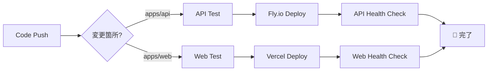

# 🚀 CI/CD 自動デプロイ設定ガイド

GitHub ActionsによるTaskAgentの自動デプロイ設定手順

## 📋 前提条件

- GitHub レポジトリへのadmin権限
- Fly.io アカウント
- Vercel アカウント
- 各種API キーの準備

## 🔑 必要なシークレット設定

### 1. GitHub Repository Secrets の設定

GitHub レポジトリの `Settings > Secrets and variables > Actions` で以下を設定：

#### 🛫 Fly.io API デプロイ用
```bash
FLY_API_TOKEN=your_fly_api_token
```

**取得方法:**
```bash
# Fly.io CLIでトークン取得
fly auth token
```

#### 🌐 Vercel デプロイ用
```bash
VERCEL_TOKEN=your_vercel_token
VERCEL_ORG_ID=your_org_id  
VERCEL_PROJECT_ID=your_project_id
```

**取得方法:**
```bash
# 1. Vercel Dashboardでトークン作成
# https://vercel.com/account/tokens

# 2. プロジェクト設定で組織IDとプロジェクトIDを取得
# Vercel Dashboard > Project Settings > General

# 3. CLIでの確認方法
vercel login
vercel link  # プロジェクトをリンク
cat .vercel/project.json  # プロジェクト情報確認
```

#### 🔒 アプリケーション環境変数
```bash
# Supabase 設定
SUPABASE_URL=https://your-project.supabase.co
SUPABASE_ANON_KEY=your_supabase_anon_key
SUPABASE_SERVICE_ROLE_KEY=your_supabase_service_role_key

# OpenAI API
OPENAI_API_KEY=sk-proj-your-openai-api-key

# Frontend用 (NEXT_PUBLIC_)
NEXT_PUBLIC_SUPABASE_URL=https://your-project.supabase.co
NEXT_PUBLIC_SUPABASE_ANON_KEY=your_supabase_anon_key
```

## 🔄 ワークフロー詳細

### 🛫 API デプロイ (`deploy-api.yml`)

**トリガー条件:**
- `main` ブランチへの `apps/api/**` 変更時
- 手動実行も可能

**実行ステップ:**
1. 🧪 **テスト実行** - Pytest によるテスト
2. 🚀 **Fly.io デプロイ** - API サーバーのデプロイ
3. 🏥 **ヘルスチェック** - デプロイ後の動作確認

### 🌐 フロントエンド デプロイ (`deploy-web.yml`)

**トリガー条件:**
- `main` ブランチへの `apps/web/**` 変更時

**実行ステップ:**
1. 🧪 **ビルドテスト** - Next.js ビルドの確認
2. 🚀 **Vercel デプロイ** - フロントエンドのデプロイ  
3. 🏥 **ヘルスチェック** - デプロイ後のアクセス確認

## 🎯 デプロイフロー



## 🛠️ 手動デプロイ

### GitHub Actions 手動実行
```bash
# GitHub WebUI から実行
1. Actions タブを開く
2. 対象ワークフローを選択
3. "Run workflow" をクリック
```

### ローカルからの手動デプロイ
```bash
# API (Fly.io)
cd apps/api
fly deploy

# Web (Vercel)  
cd apps/web
vercel --prod
```

## 📊 デプロイ状況の確認

### 🔍 デプロイログ確認
```bash
# GitHub Actions ログ
https://github.com/your-username/TaskAgent/actions

# Fly.io ログ
fly logs -a taskagent-api

# Vercel ログ  
vercel logs
```

### 🏥 ヘルスチェック URL
```bash
# API ヘルスチェック
https://taskagent-api.fly.dev/health

# API ドキュメント
https://taskagent-api.fly.dev/docs

# フロントエンド
https://taskagent.vercel.app
```

## ⚠️ トラブルシューティング

### API デプロイエラー
```bash
# 1. Fly.io トークン確認
echo $FLY_API_TOKEN

# 2. 手動デプロイでテスト
fly deploy --verbose

# 3. 環境変数確認
fly secrets list
```

### フロントエンドデプロイエラー
```bash
# 1. Vercel トークン確認  
vercel whoami

# 2. ビルドエラー確認
npm run build

# 3. 環境変数確認
vercel env ls
```

### 共通エラー対処
```bash
# GitHub Secrets が正しく設定されているか確認
# レポジトリ権限が適切か確認
# API制限に引っかかっていないか確認
```

## 🔄 継続的改善

### パフォーマンス監視
- Vercel Analytics
- Fly.io Metrics
- GitHub Actions 実行時間

### セキュリティ更新
- 依存関係の定期更新
- シークレットのローテーション
- アクセス権限の見直し

## 📚 参考リンク

- [GitHub Actions Documentation](https://docs.github.com/en/actions)
- [Fly.io CI/CD Guide](https://fly.io/docs/app-guides/continuous-deployment-with-github-actions/)
- [Vercel GitHub Integration](https://vercel.com/docs/concepts/git/vercel-for-github)
- [Supabase Environment Variables](https://supabase.com/docs/guides/getting-started/environment-variables)